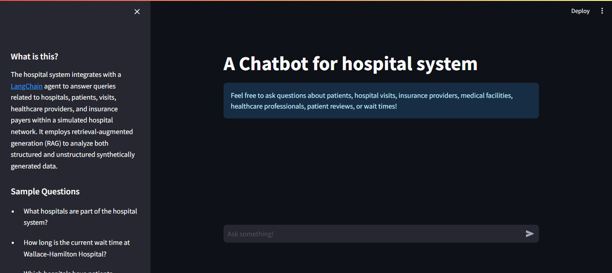
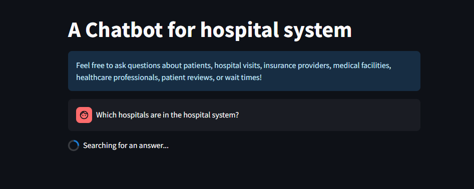
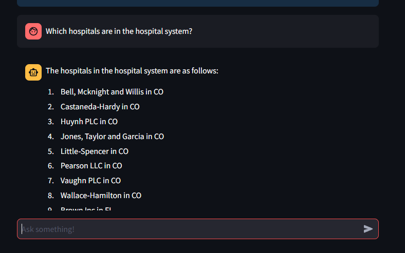

# A Chatbot for Hospital System

A chatbot system built with Neo4j, FastAPI, and Streamlit for querying hospital data using natural language processing.



## Prerequisites

- Python 3.8+
- Docker
- OpenAI API Key

## Setup Instructions

### 1. Initial Setup

First, clone the repository and navigate to the project root directory. Create a `.env` file with the following configuration:

```plaintext
OPENAI_API_KEY="Enter you OpenAI API Key"

# Neo4j Configuration
NEO4J_URI=bolt://localhost:7687
NEO4J_USERNAME=neo4j
NEO4J_PASSWORD=password

# Data Source Paths
HOSPITALS_CSV_PATH=https://raw.githubusercontent.com/hfhoffman1144/langchain_neo4j_rag_app/main/data/hospitals.csv
PAYERS_CSV_PATH=https://raw.githubusercontent.com/hfhoffman1144/langchain_neo4j_rag_app/main/data/payers.csv
PHYSICIANS_CSV_PATH=https://raw.githubusercontent.com/hfhoffman1144/langchain_neo4j_rag_app/main/data/physicians.csv
PATIENTS_CSV_PATH=https://raw.githubusercontent.com/hfhoffman1144/langchain_neo4j_rag_app/main/data/patients.csv
VISITS_CSV_PATH=https://raw.githubusercontent.com/hfhoffman1144/langchain_neo4j_rag_app/main/data/visits.csv
REVIEWS_CSV_PATH=https://raw.githubusercontent.com/hfhoffman1144/langchain_neo4j_rag_app/main/data/reviews.csv

# Model Configuration
HOSPITAL_AGENT_MODEL=gpt-3.5-turbo-1106
HOSPITAL_CYPHER_MODEL=gpt-3.5-turbo-1106
HOSPITAL_QA_MODEL=gpt-3.5-turbo-0125

# Service URLs
CHATBOT_URL=http://host.docker.internal:8000/hospital-rag-agent
```

Update the `.env` with your OpenAI API Key , and change the neo4j credentials accordingly to the docker run command for Neo4j container in the next steps.

### 2. Python Environment Setup

Create and activate a virtual environment:

```bash
python -m venv venv
./venv/Scripts/activate  # Windows
source venv/bin/activate  # Linux/Mac
```

Install required packages:

```bash
pip install -r requirements.txt
```

### 3. Neo4j Setup

Start Neo4j container with APOC:

```bash
docker run --name neo4j-apoc \
    -e NEO4J_AUTH=neo4j/password \
    -p 7474:7474 -p 7687:7687 \
    -e NEO4J_apoc_export_file_enabled=true \
    -e NEO4J_apoc_import_file_enabled=true \
    -e NEO4J_apoc_import_file_use__neo4j__config=true \
    -e NEO4J_PLUGINS='["apoc"]' \
    -e NEO4J_dbms_security_procedures_unrestricted=apoc.* \
    -e NEO4J_dbms_security_procedures_allowlist=apoc.* \
    neo4j:latest
```

Install APOC plugin:

```bash
docker exec neo4j-apoc cp /var/lib/neo4j/labs/apoc-5.26.0-core.jar /var/lib/neo4j/plugins/
```

### 4. Data Loading

Navigate to the ETL directory and run the data loading script:

```bash
cd hospital_neo4j_etl/src
python hospital_bulk_csv_write.py
```

### 5. Starting the Services

Start the backend API:

```bash
cd chatbot_api/src
uvicorn main:app --host 0.0.0.0 --port 8000
```

Start the frontend application:

```bash
cd chatbot_frontend/src
streamlit run main.py
```

### 6. Accessing the Application

- Backend API documentation: [http://localhost:8000/docs](http://localhost:8000/docs)
- Frontend chatbot interface: [http://localhost:8501/](http://localhost:8501/)

## Sample Questions

Try these questions to test the chatbot:

- "Which hospitals are in the hospital system?"
- "How much was billed for patient 789's stay?"





## Project Structure

```
├── chatbot_api/
│   └── src/
│       └── main.py
├── chatbot_frontend/
│   └── src/
│       └── main.py
├── hospital_neo4j_etl/
│   └── src/
│       └── hospital_bulk_csv_write.py
├── .env
├── requirements.txt
└── README.md
```

## Notes

- Ensure Docker is running before starting the Neo4j container
- The OpenAI API key must be valid for the chatbot to function
- All services must be running simultaneously for the system to work properly

## Troubleshooting

If you encounter issues:
1. Verify all environment variables are set correctly
2. Ensure Neo4j is running and accessible
3. Check if all required Python packages are installed
4. Verify the OpenAI API key is valid and has sufficient credits
